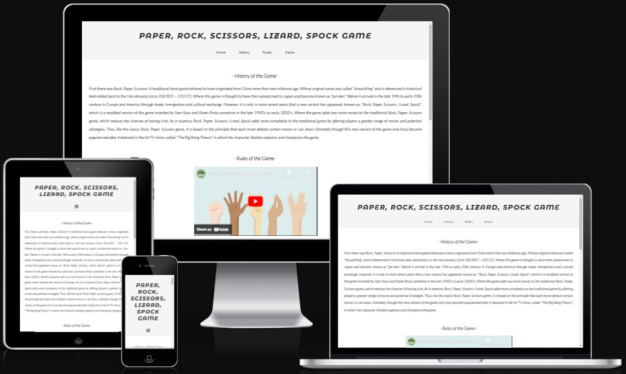
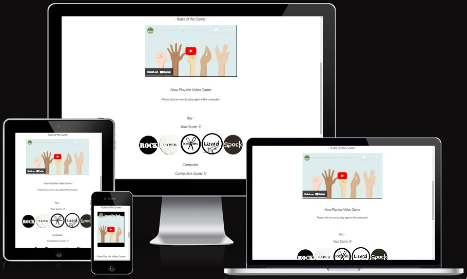
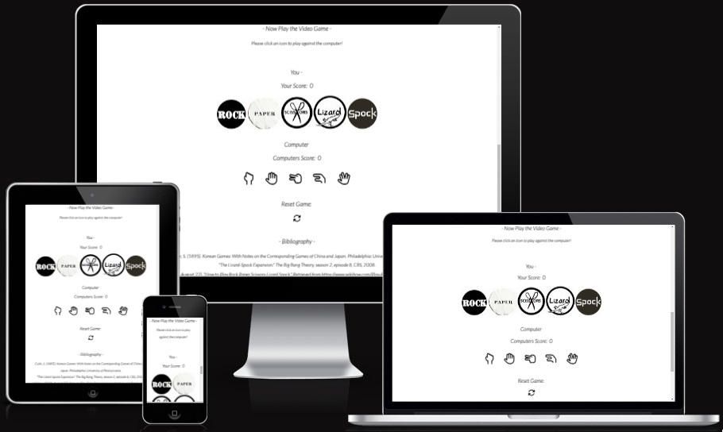
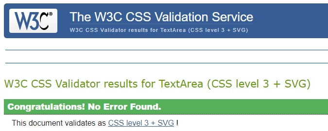
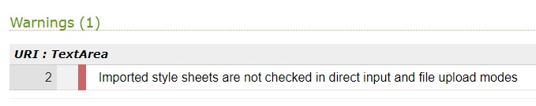
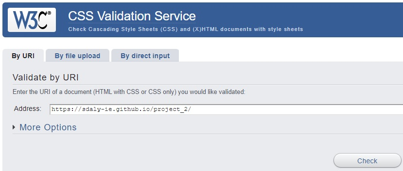

# __Project 2__
## __Introducing:__ 
### Rock, Paper, Scissors, Lizard, Spock - The Ultimate Online Hand Game!

From the ancient Chinese dynasty emerges a hand game that has traveled through the silk routes, sailed the seas, and spanned centuries to reach us: Rock, Paper, Scissors. Originally christened "shoushiling", this game wove its way into Japanese traditions as "jan-ken" before making its historic journey to the shores of Europe and America. Its simplicity charmed generations, and the game became a household name across continents.

But, like all great legends, it was destined for evolution.

Enter the 21st century, and the game is reborn with a twist, thanks to the ingenuity of Sam Kass and Karen Bryla. This dynamic duo introduced two cunning new characters to the mix: the Lizard and Spock! Their creation added layers of strategy, reduced the monotony of ties, and redefined the classic, giving it a fresh, modern feel.

While its origins may be humble, its claim to fame came under the limelight of Hollywood. The streets buzzed, social media trended, and living rooms laughed as Sheldon from "The Big Bang Theory" introduced the world to the intricate ballet of Rock, Paper, Scissors, Lizard, Spock. Now, with the power of HTML5, CSS3, and Javascript, we bring this exciting game to your screens. Whether you're a nostalgic enthusiast or a new fan looking for a strategy-filled showdown, this game is designed for you!

So, what will it be? Rock, Paper, Scissors, Lizard, or Spock? Choose wisely and may the odds be ever in your favor!
 
 

## __Testing:__

>__Browser compatability assessment:__

|           Browser          |     Notes     |
| -------------------------- | ------------- |
| Chrome                     | Tested: works |
| Microsoft Edge             | Tested: works |
| FireFox                    | Tested: works |
| Safari                     | Tested: works |
| DuckDuckGo                 | Tested: works |

>__Responsive Design table:__

|        Screen Model        |     Notes     |
| -------------------------- | ------------- |
| iPhone SE                  | Tested: works |
| iPhone XR                  | Tested: works |
| iPhone 12 Pro              | Tested: works |
| Pixel 5                    | Tested: works |
| Samsung Galaxy S8+         | Tested: works |
| Samsung Galaxy S20 Ultra   | Tested: works |
| iPad Air                   | Tested: works |
| iPad Mini                  | Tested: works |
| Surface Pro 7              | Tested: works |
| Surface Duo                | Tested: works |
| Galaxy Fold                | Tested: works |
| Samsung Galaxy A51/71      | Tested: works |
| Nest Hub                   | Tested: works |
| Nest Hub Max               | Tested: works |
| Medium Desktop 992px       | Tested: works |
| Large Desktop 1200px       | Tested: works |
| XL Desktop >1200px         | Tested: works |

_Note: The above testing was carried out in Chrome DevTools_ 
 
 

### __HTML5, CSS3 and JavaScript Validation Testing:__

* __HTML5 Validation Results:__ 
_No errors were returned when passing code through the official W3C validator by direct input._

 
 
 
* __CSS3 Validation Results:__ 
_No errors were found when passing code through the official (Jigsaw) validator by direct input._

__Note:__ _However, (x1) Warning was observed and this was related to the @import url()._

Requiring further assessment

 
 
 
* __JavaScript Validation Results:__
_No errors or warnings were reported when passing code through the JSHint tool. 
__Note:__ Configure option, 'New JavaScript features (ES6)' was set to enabled for 
assessment_

