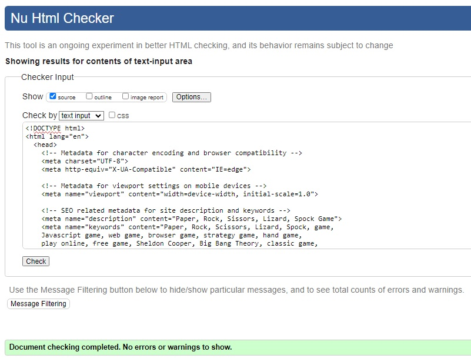

# __Project 2__
## __Introducing:__ 
### Rock, Paper, Scissors, Lizard, Spock - The Ultimate Online Hand Game!

From the ancient Chinese dynasty emerges a hand game that has traveled through the silk routes, sailed the seas, and spanned centuries to reach us: Rock, Paper, Scissors. Originally christened "shoushiling", this game wove its way into Japanese traditions as "jan-ken" before making its historic journey to the shores of Europe and America. Its simplicity charmed generations, and the game became a household name across continents.

But, like all great legends, it was destined for evolution.

Enter the 21st century, and the game is reborn with a twist, thanks to the ingenuity of Sam Kass and Karen Bryla. This dynamic duo introduced two cunning new characters to the mix: the Lizard and Spock! Their creation added layers of strategy, reduced the monotony of ties, and redefined the classic, giving it a fresh, modern feel.

While its origins may be humble, its claim to fame came under the limelight of Hollywood. The streets buzzed, social media trended, and living rooms laughed as Sheldon from "The Big Bang Theory" introduced the world to the intricate ballet of Rock, Paper, Scissors, Lizard, Spock. Now, with the power of HTML5, CSS3, and Javascript, we bring this exciting game to your screens. Whether you're a nostalgic enthusiast or a new fan looking for a strategy-filled showdown, this game is designed for you!

So, what will it be? Rock, Paper, Scissors, Lizard, or Spock? Choose wisely and may the odds be ever in your favor!
 
 

## __Testing:__

>#### __1. Responsiveness assessment:__

|        Screen Model        |     Notes     |
| -------------------------- | ------------- |
| iPhone SE                  | Tested: works |
| iPhone XR                  | Tested: works |
| iPhone 12 Pro              | Tested: works |
| Pixel 5                    | Tested: works |
| Samsung Galaxy S8+         | Tested: works |
| Samsung Galaxy S20 Ultra   | Tested: works |
| iPad Air                   | Tested: works |
| iPad Mini                  | Tested: works |
| Surface Pro 7              | Tested: works |
| Surface Duo                | Tested: works |
| Galaxy Fold                | Tested: works |
| Samsung Galaxy A51/71      | Tested: works |
| Nest Hub                   | Tested: works |
| Nest Hub Max               | Tested: works |
| Medium Desktop 992px       | Tested: works |
| Large Desktop 1200px       | Tested: works |
| XL Desktop >1200px         | Tested: works |

_Note: The above testing was carried out using Chrome DevTools. Where the scope of testing encompassed the webpage loading and displaying its intended layout and content correctly; links functioned correctly; embedded video operates correctly; game and reset operate correctly (including displaying the correct results)_ 
 
 

>#### __2. Browser compatability assessment:__

|           Browser          |     Notes     |
| -------------------------- | ------------- |
| Chrome                     | Tested: works |
| Microsoft Edge             | Tested: works |
| FireFox                    | Tested: works |
| Safari                     | Tested: works |
| DuckDuckGo                 | Tested: works |

_Note: The scope of testing encompassed the webpage loading and displaying its intended layout and content correctly; links functioned correctly; embedded video operates correctly; game and reset operate correctly (including displaying the correct results)_

 

>#### __3. High level summary on bugs and issues encountered:__

* __Logic Errors:__  
  In the early development phase, logic errors were causing the game to have no response to player interaction when tested or produced incorrect winner determination or score updates. These issues were the result of trying to achieve to much to soon, thereby creating some very messy code structure, which was either not or poorly commented to help remember what does what and when it should. This lead to starting everything again and adopting a minimum viable product (MVP) approach to towards the games development, with better code structure, functions modular and much clear commenting to help keep track of things before git pushes.

* __Maintenance:__   
  I found myself not being very efficient when coding, resulting in repeated code being present in the codebase. This made code maintenance and picking apart problems a little harder than it needed to be and increased the likelihood of inconsistencies occuring. As my confidence grew, I adopted the DRY (Don't Repeat Yourself) Principle to help minimize redundancy and avoid future problems. Especially if I would like to go back and further develop the game.

* __Game_Limitations:__  
  Having taking a MVP approach to the development of the game, a limitation is its UI/UX, particularly on smaller mobile screens, which could do with further development.  

* __Unfixed bugs:__  
  No unfixed bugs.
  
 

>#### 4. __Lighthouse assessment:__
* The open-source tool Lighthouse was used to provide insights and actionable guidance for improving webpage design by assessing its quality via five metrics: Performance, Accessibility, Best Practices, Search Engine Opitmization (SEO) and Progressive Web App (PWA). With particular emphasis during the project paid to accessibility to ensure the site is more accessible to users with disabilities.
 
 

__Fig. 1  Summary result for mobile's__ 

 

__Fig. 2  Summary result for Desktop's__ 

 
 

>#### 5. __Code Validation:__

* __HTML5 Validation Results:__ 
_No errors were returned when passing code through the official W3C validator by direct input._

 
 
* __CSS3 Validation Results:__ 
_No errors were found when passing code through the official (Jigsaw) validator by direct input._

 

__Note:__ _However, (x1) Warning was observed and this was related to the @import url()._

_Requiring further assessment W3C CSS Validator by Deployed website URL._

_Which Resulted in no errors reported._

 
 
* __JavaScript Validation Results:__
_No errors or warnings were reported when passing code through the JSHint tool. 
__Note:__ Configure option, 'New JavaScript features (ES6)' was set to enabled for 
assessment_

 
 

## __User Stories:__

  __User Story:__  
  I want to quickly learn and easily navigate through the _“Paper, Rock, Scissors, Lizard, Spock Game”_ website. So that I can understand its history, learn the rules and enjoy playing the game without confusion.
 

__User Story Testing:__  

(1) Understand the Game’s History:
* User can read and understand the history of the game.
* Text is legible, and information is concise and informative.

(2) Learn the Rules:

* User should be able to learn the rules by watching an embedded video.
* Controls for the video player are accessible and easy to use.

(3) Play the Game:

* The game is simple to play with it being intuitive on how to make a selection.
* User can easily select from the provided options and view results.
* User can keep track of scores and reset the game with ease.

(4) Navigate the Website:
* The navigation menu is functional and directs the user to the corresponding sections of the page.
* Navigation is responsive and works on various screen sizes/devices.
* Player has visibility on Social Media Links for accessability and links are functionally correct, opening on a new tab.
 
 

##  __Features:__
🚀 __Galactic Game Fusion:__ An intertwining of traditional and pop culture through the "Paper, Rock, Scissors, Lizard, Spock Game," offering a digital gameplay experience that melds ancient hand games with contemporary references from the Big Bang Theory.

💻 __Intuitive Navigation:__ A sleek navigation bar with cosmic clarity, guiding visitors through the interstellar journey from Home, through the mystical History, the crucial Rules, and ultimately landing them at the gaming portal - the Game section.

📜 __Fansinating Backstory:__ A compelling "History of the Game" section that weaves through times and civilizations, exploring the traditional "Rock, Paper, Scissors" and its evolution into the renowned "Rock, Paper, Scissors, Lizard, Spock," enchanted with cultural and pop cultural references.

🎥 __Video Enchantment:__ An embedded magical viewport (YouTube video) within the “Rules of the Game” section, elucidating the method of play through visual storytelling, offering both visual and auditory learning experiences to the space travellers (users).

🎮 __Interactive Gameplay Arena:__ Engaging, real-time gameplay with interactive iconography, allowing users to combat the computer through strategic selections from the cosmic entities - Rock, Paper, Scissors, Lizard, Spock.

🔄 __A Galactic Reset:__ A convenient reset icon, permitting players to cleanse the cosmic energies and restart their gameplay, ensuring an endless loop of entertainment and strategic battles.

📚 __Wise Scrolls of Bibliography:__ An academic and media-infused bibliography, granting acknowledgement to the ancient texts and modern visual tales that have contributed to the knowledge and popularization of the game.

🌐 __Social Constellations:__ An array of vibrant social media icons at the base, forging pathways to other digital universes (social media platforms), thus enabling users to share their experiences, victories, and strategies across the cosmic web.

📲 __Responsive Design Magic:__ Incorporation of viewport meta tag ensuring the website morphs magically, providing an optimal viewing experience across a cascade of devices from mystical scrolls (mobiles) to grand portals (desktops).

🎨 __Visual Elegance:__ Elegantly crafted visual elements such as non-copyright images generated by DALL E and user-friendly interfaces ensuring an aesthetically pleasing and smooth navigation through the digital cosmos.

🚥 __SEO Mastery:__ Strategic embedding of meta tags to ensure the cosmic game portal is easily discovered by digital space travellers through the vast expanse of the search engine universe.

📜 __CSS Style Enchantment:__ External CSS styling through a linked stylesheet, ensuring a visually coherent and aesthetically appealing experience through unified design elements.

💾 __Dynamic Interaction Coding:__ Inclusion of JavaScript for dynamic, interactive, and engaging gameplay, while also supporting the ethereal hamburger menu, providing a seamless and magical user experience.

🔗 __Font Awesomeness:__ A celestial library (Font Awesome) integrated, providing a plethora of icons to enhance visual communication and enrich user interface with stellar icons.
 
 

## __Deployment:__

* The site was deployed using GitHub, by visiting the repository, clicking Settings, selecting Pages, and ensuring that the Source was set to Main before Saving. Once the site had refreshed a link appeared on the page with the text: "Your site is live at", which when clicked confirmed a successful deployment. The live link can be found here - 
  <https://sdaly-ie.github.io/project_2/>
 
 

## __Credits:__

Include Code Institutes Sample README.md file, its learning curriculum, love maths and a series of tutorials:

* Hodovaniuk M. "How to Create Rock Paper Scissors Spock Lizard in JavaScript." Hackernoon, 09 May 2021, https://hackernoon.com/how-to-create-rock-paper-scissors-spock-lizard-in-javascript-991k36hy
 * Dima. "How to code Rock, Paper, Scissors, Lizard and Spoke in Javascript." Competent Programming channel - YouTube, 2021, https://www.youtube.com/watch?v=lV2BMXdsDmc
 * Yadav P. "Rock, Paper, Scissor, Lizard, Spock game in javascript." Learners Bucket, 19 May 2020, https://learnersbucket.com/tutorials/js-projects/rock-paper-scissor-lizard-spock-game-in-javascript/
 * Brennan. "Rock, Paper, Scissors, Lizard, Spock." CodePen, 2023, https://codepen.io/763004/pen/pPGGyP
 * Wong J, Neagoie A. "JavaScript Web Projects: 20 Projects to Build Your Portfolio." ZTM, 2023, https://academy.zerotomastery.io/courses/enrolled/1007166
 * Nunez M. "JavaScript - How to Create a Responsive Hamburger Menu with HTML, CSS, & JavaScript." Web Dev Tutorials - YouTube, 2021, https://www.youtube.com/watch?v=flItyHiDm7E

Site fonts are from Google Fonts, link: <https://fonts.google.com/>

Icons used in the footer were provided by Font Awesome, link: <https://fontawesome.com/>

For site contents please refer to the bibilography section at the end of the webpage and player icon images generated by DALL-E for educational and non commerical use. While the video displayed is directly linked to the original source material via its iframe.

Finally, extra help on troubleshoots or generalized understanding of code and project was sourced from: Google Searches, Slack, such as: Manual testing overview.pdf, YouTube and ChatGPT4.